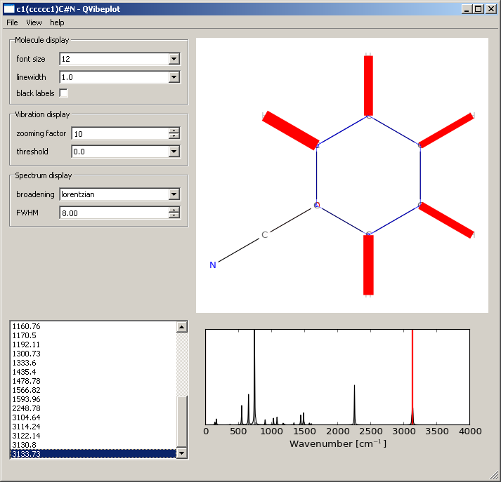

.. vibeplot documentation master file, created by
   sphinx-quickstart on Sun Oct  2 15:09:06 2011.
   You can adapt this file completely to your liking, but it should at least
   contain the root `toctree` directive.

Welcome to vibeplot's documentation!
====================================

Vibeplot presents a new and attractive way to visualize vibrational analysis
from density functional calculations (DFT) in two dimensions. It is especially
targeted at the chemists. The interface can either be scripted or used
interactively with QVibeplot. The idea is to display normal coordinates
(converted displacements of the atoms within the molecule) in terms of changes
of the internal coordinates.

- Bond-length changes (stretching) are indicated by coloring the bonds.
- Angle changes (e.g. like in-plane deformations) are indicated with an arc.
- Torsion changes (e.g. like out-of-plane deformations) are indicated with
  Bezier curves pointing towards the atoms concerned.

In any case, the phase is indicated by the color of the marker, the same color
indicates the same direction for the change.

QVibePlot
=========

QVibePlot is the graphical user interface to interact with the vibeplot
library.

- The top-left pane displays options to tune the display of the image.
- The top-right pane shows the molecule and the visualization.
- The bottom-left pane displays the list of frequencies available for
  the molecule loaded.
- The bottom-right pane represents the spectrum, the currently selected
  vibration is marked in red. (Here, the CN stretch.)

Interactive session with vibeplot
=================================

The vibeplot library may be used directly to generate the plots interactively
with Matplotlib or in batch.  The example provided here is for the 0.14 series.

>>> import pybel
>>> import openbabel as ob
>>> import matplotlib.pyplot as plt
>>> from vibeplot.plotter import VibrationPlotter
>>> import vibeplot.sdg as sdg

We first instanciate a :class:`VibrationPlotter` object and provide is with a
figure and axes.

>>> vb = VibrationPlotter()
>>> vb.fig = plt.figure()
>>> vb.axes = vb.fig.add_subplot(111)

We now load the data from a file named ``benzene.molf`` in the Molden format
[#molden.fmt]_.

>>> molecule = pybel.readfile("data/benzene.input")
>>> vb.molecule = molecule.OBMol
>>> vibrations = ob.toVibrationData(molecule.OBMol.GetData(ob.VibrationData))
>>> vb.normal_coordinates = vibrations.GetLx()

The 'VibrationPlotter' object created above contains a series of
'VibrationPlotter.get_*' methods that are called in order to draw a molecule
and add the markers.  Extra keyword arguments passed to them is forwarded to
Matplotlib (an example could be to set the 'linewidth' or 'zorder').  Moreover,
two convenience methods are provided, 'plot_molecule' and 'plot_vibration',
that call the relevant 'get_*' with good default arguments.

>>> vb.plot_molecule()

We now have the skeleton of a benzene molecule. We pop and display a random
vibration.

>>> vb.plot_vibration(5)
>>> plt.show()

And let us save the results using another convenience method 'save_molecule'.

>>> vb.save_molecule("%.0f.png" % frequency)

This simple demonstration shows most of what is possible with vibeplot.

.. image:: 3100.png
   :scale: 30 %

.. [#molden.fmt] Description of the `Molden format`_
.. [#mpl.col] API of `Matplotlib.collections`_

.. _Molden format: http://www.cmbi.ru.nl/molden/molden_format.html
.. _Matplotlib.collections: http://matplotlib.sourceforge.net/api/collections_api.html

Installation
============

QVibePlot for Windows
---------------------
No installation is necessary for QVibePlot.

Download the latest Windows release from sourceforge_, unzip the archive in an
empty directory and run QVibePlot.exe from there.

Install from sources
--------------------

dependencies
~~~~~~~~~~~~
install the required dependencies

* Matplotlib
* numpy
* RDKit [0.13 series only]
* Oasa [0.13 series only]
* openbabel 2.3.0 [0.14 series only]
* pybel [0.14 series only]
* PyQt4 [required only for QVibePlot]

installation
~~~~~~~~~~~~

Download the source from sourceforge_ or clone the git repository

.. code-block:: text

    git://vibeplot.git.sourceforge.net/gitroot/vibeplot/vibeplot (read-only)

and run ``python setup.py install`` from the root directory.

That will install both QVibePlot and the vibeplot module.

.. _sourceforge: http://sourceforge.net/projects/vibeplot/

Contents
========

.. toctree::
    :maxdepth: 2
    
    api
    license

Indices and tables
==================

* :ref:`modindex`
* :ref:`search`

