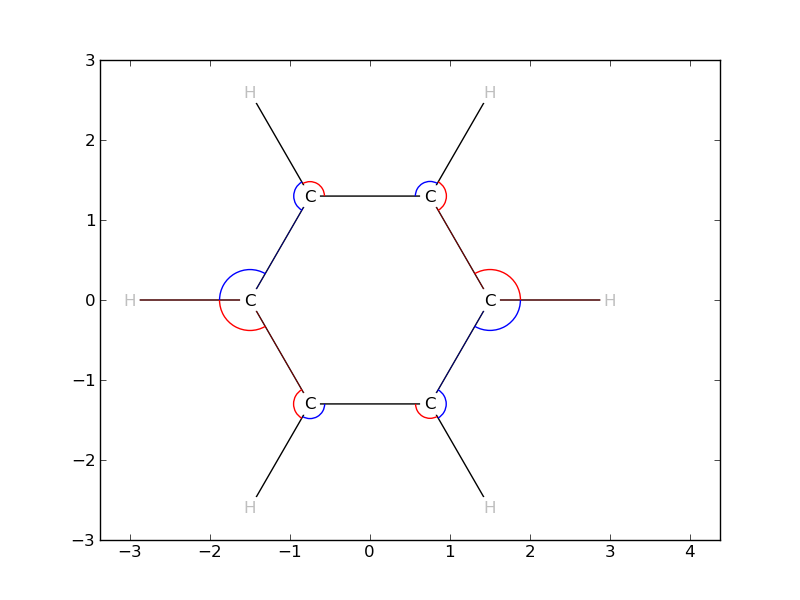

Interactive session with Vibeplot
=================================

The vibeplot library may be used directly to generate the plots interactively
with Matplotlib or in batch.

>>> import matplotlib.pyplot as plt
>>> from vibeplot.vibeplot import Vibeplot
>>> from vibeplot.datafile import MoldenFile
>>> vb = Vibeplot()

We now load the data from a file named ``benzene.input`` 
in the Molden format [#molden.fmt]_.

>>> vb.molecule.load_data(MoldenFile('data/benzene.input'))

Extra keyword arguments passed to the series of ``vibeplot.get_*`` methods are
forwarded to Matplotlib. For example here, we pass ``zorder=10``

>>> plt.axes().add_collection(vb.get_bond_collection(zorder=10))
<matplotlib.collections.PatchCollection at 0x..>
>>> plt.axes().axis('image')
( ... )
>>> plt.axes().axis('equal')
(-3.0, 4.0, -3.0, 3.0)

Matplotlib does not have text collections. The labels are obtained from the
generator ``vibeplot.atom_label_text_iter`` in a form that can readily be
passed to Matplotlib.axes.text, here as well, extra keyword arguments are
forwarded to Matplotlib.

>>> for label in vb.atom_label_text_iter(zorder=100, size=12):
>>>     plt.axes().text(*label)

We now have the skeleton of a benzene molecule. We pop and display a random
vibration.

>>> ref, vibration = vb.molecule.vibrations.popitem()
>>> vibration.frequency
1168.6400000000001
>>> bl = vb.get_bondlength_change_collection(vibration, zorder=20)
>>> a = vb.get_angle_change_collection(vibration, zorder=25)
>>> oop = vb.get_oop_angle_change_collection(vibration, zorder=30)

Vibeplot returns matplotlib objects [#mpl.col]_, which can be added directly to the axes.

>>> plt.axes().add_collection(bl)
<matplotlib.collections.PathCollection at 0x..>
>>> plt.axes().add_collection(a)
<matplotlib.collections.PatchCollection at 0x..>
>>> plt.axes().add_collection(oop)
<matplotlib.collections.PathCollection at 0x..>
>>> plt.savefig("demo.png")
>>>

This simple demonstration shows most of what is possible with vibeplot.

.. [#molden.fmt] Description of the `Molden format`_
.. [#mpl.col] API of `Matplotlib.collections`_

.. _Molden format: http://www.cmbi.ru.nl/molden/molden_format.html
.. _Matplotlib.collections: http://matplotlib.sourceforge.net/api/collections_api.html
