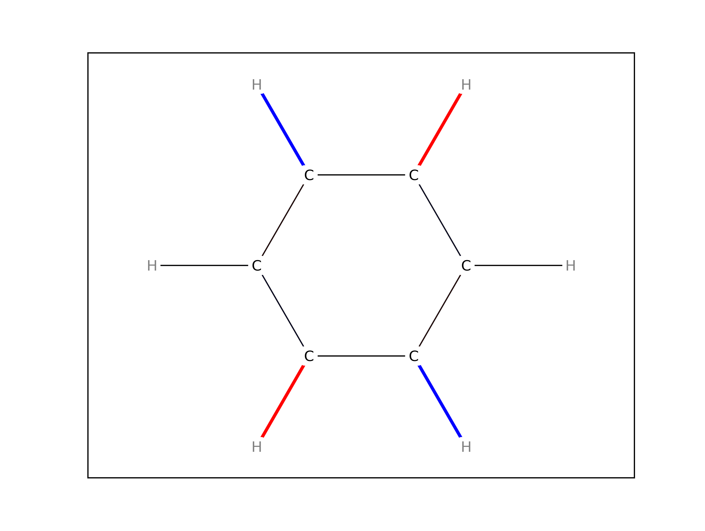

Interactive session with Vibeplot
=================================

The vibeplot library may be used directly to generate the plots interactively
with Matplotlib or in batch.

>>> import matplotlib.pyplot as plt
>>> from vibeplot.plotter import VibrationPlotter
>>> from vibeplot.parser import molden
>>> import vibeplot.sdg as sdg

We first instanciate a 'VibrationPlotter' object and provide is with a figure
and axes.

>>> vb = VibrationPlotter()
>>> vb.fig = plt.figure()
>>> vb.axes = vb.fig.add_subplot(111)

We now load the data from a file named ``benzene.input`` 
in the Molden format [#molden.fmt]_.

>>> molecule, spectrum = molden.load_molden("data/benzene.input")
>>> sdg.sdg(molecule)
>>> vb.molecule = molecule

The 'molecule' is a 'chemistry.molecule' object and the 'spectrum' is a 'dict'
mapping intensities onto frequencies.

The 'VibrationPlotter' object created above contains a series of
'VibrationPlotter.get_*' methods that are called in order to draw a molecule
and add the markers.  Extra keyword arguments passed to them is forwarded to
Matplotlib (an example could be to set the 'linewidth' or 'zorder').  Moreover,
two convenience methods are provided, 'plot_molecule' and 'plot_vibration',
that call the relevant 'get_*' with good default arguments.

>>> vb.plot_molecule()

We now have the skeleton of a benzene molecule. We pop and display a random
vibration.

>>> frequency, intensity = spectrum.items()[7]
>>> print(frequency)
3099.96

>>> vb.plot_vibration(frequency)
>>> plt.show()

And let us save the results using another convenience method 'save_molecule'.

>>> vb.save_molecule("%.0f.png" % frequency)

This simple demonstration shows most of what is possible with vibeplot.

.. [#molden.fmt] Description of the `Molden format`_
.. [#mpl.col] API of `Matplotlib.collections`_

.. _Molden format: http://www.cmbi.ru.nl/molden/molden_format.html
.. _Matplotlib.collections: http://matplotlib.sourceforge.net/api/collections_api.html

